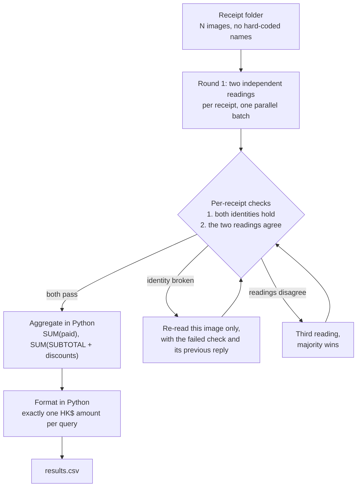

# FTEC5660 Homework 1: Receipt Chain

Build a LangChain pipeline that reads every supermarket receipt in a folder
with the vision-capable DeepSeek Flash model and answers these two questions:

1. How much money did I spend in total for these bills?
2. How much would I have had to pay without the discount?

For this homework, **amount spent** means the final payment after the receipt's
rounding line. **Without the discount** means the sum of the original positive
item prices: add back every promotion, coupon, member, app, packaging-damage,
and percentage discount, but do not add back rounding.

## Student task

Only edit the two functions in `hw1.py` that contain `### YOUR CODE HERE`:

- `build_chain()` creates your LangChain chain.
- `answer_queries()` runs the chain on the receipt images and returns one final
  response for each question.

You may use prompt chaining, routing, parallel calls, reflection, or a
combination. Your final responses should each contain one HKD amount. Do not
hard-code filenames or public answers; grading uses unseen receipt folders.

## Setup and public test

```bash
python3 -m venv .venv
source .venv/bin/activate
pip install -r requirements.txt
```

Put your DeepSeek key after `DEEPSEEK_API_KEY=` in `.env`, then run:

```bash
python3 hw1.py --image-folder public_test
```

The program creates `results.csv` in the current directory. Its columns are
`query`, `model_response`, and `correctness`. The public answers are in
`public_test/ground_truth.json`. The starter intentionally returns the dummy
response `please design your chain to answer these two queries.` so it runs
before you add any API code.

The required model is `deepseek-v4-flash-vision-exp`, the vision-capable
DeepSeek Flash model. JPEG, PNG, GIF, and WebP inputs are accepted by the
homework runner.


## Homework 1 solution:

### Chain design



### Description

The chain is a **map-reduce pipeline** over the receipt images rather than a single
end-to-end question. The *map* stage sends each receipt to
`deepseek-v4-flash-vision-exp` in its own multimodal call and asks for one strict JSON
object holding `items`, `discount_lines`, `subtotal`, `rounding` and `paid`. Restricting
each call to a single image keeps the task purely perceptual: the model reads figures off
one receipt instead of having to read several, add them up, and remember two questions at
once. Discount lines are requested as positive amounts with `rounding` kept in a separate
field, so the ROUNDING line can never be mistaken for a discount. Each receipt is then
*reflected on* twice over. First, two identities must hold —
`sum(items.price) - sum(discount_lines.amount) = subtotal` and `subtotal + rounding = paid`.
Second, and this turned out to be the decisive step, **the receipt is read twice and the two
readings must agree** on the paid amount, the no-discount total and the SUBTOTAL before
either is accepted; a third reading, sent only for receipts that disagreed, breaks the tie.
Agreement is required because the endpoint is **not deterministic even at temperature 0** —
measured on a three-receipt subset, five identical requests returned the correct
no-discount total four times and a total HK$1.00 low once, raising no validation error at
all. That failure is a *compensating* one: dropping an item line and a discount line of the
same value leaves `sum(items) - sum(discounts)` equal to `SUBTOTAL` while understating the
no-discount total, so it is invisible to any self-consistency check precisely because it is
self-consistent. Requiring two independent readings to land on the same figures is what
catches it, and because both readings go out in the same `chain.batch` wave the extra sample
costs tokens rather than latency. The *reduce* stage never touches the model: every amount
is combined in Python with `Decimal`, which avoids the multi-step addition errors a language
model makes and the rounding drift that binary floats would introduce across receipts. The
final strings (`HK$1974.30`, `HK$2348.20`) are also assembled in Python rather than written
by the model, which guarantees each response contains exactly one numeric amount and so
survives the scorer's single-amount rule. The pipeline is fail-soft: a fatal authentication
or missing-model error stops retrying immediately, unreadable receipts are reported on
`stderr` and skipped, and `results.csv` is always written, because a crash or a hang scores
zero regardless of chain quality.

To run it, put the DeepSeek key in `.env` as `DEEPSEEK_API_KEY=...`. If the
`deepseek-v4-flash-vision-exp` endpoint is not the default DeepSeek host, also set the base
URL there as `DEEPSEEK_BASE_URL=https://<host>/v1`; the chain picks it up automatically.

